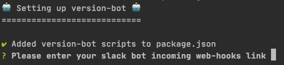

<p align="center">
 
</p>

So your company maintains a library, for example, a core components library. With each release, you have the overhead of updating everyone about the new features that have been added or fixed.

No More! Using this library, you can hook into the [standard-version](https://github.com/conventional-changelog/standard-version) library and automatically post a clear and customizable CHANGE LOG message right into your Slack channel!

<hr />

<!-- ALL-CONTRIBUTORS-BADGE:START - Do not remove or modify this section -->
[](#contributors-)
<!-- ALL-CONTRIBUTORS-BADGE:END -->

## 🌩 Installation

Install `version-bot` by running:

```
npm i @skazaz/version-bot
yarn @skazaz/version-bot
```

Initialize the version bot's configuration by running:

```
version-bot init
```

The above command does the following:
* Adds version bot scripts to you `package.json`
```
// package.json
{
  ...
  "scripts": {
    ...
    "version-bot:build-message": "version-bot build-message",
    "version-bot:post-message": "version-bot post-message"
  }
}
```
* Enter your slack bot [incoming webhooks link](https://api.slack.com/messaging/webhooks)



* Updates/creates your standard-version configuration with the version bot config.
```
// your standard-version configuration location (package.json | .versionrc.json | .versionrc.js)
{
  ...
  "version-bot": {
    webHookLink: "<my link>"
  }
}
```

The last thing we need to do is run the `post-message` command after we publish our package:
```
// package.json
{
  ...
  "scripts": {
    ...
    "publish": "npm publish && npm run version-bot:post-message"
  }
}
```

Now your slack bot will start posting the version changes 🎉.

##  Commands

These are the 3 available commands: 

* `init` - Initializes the version-bot configuration.
* `build-message` - Builds the changelog message for the slack bot, automatically runs as part of the [standard-version lifecycle scripts](https://github.com/conventional-changelog/standard-version#lifecycle-scripts) (if you ran the `init` command).
* `post-message` - Sends the message to your slack bot.

## 🕹 Options

- `package`: The path to your `package.json` file: (defaults to `process.cwd()`)

```
version-bot build-message --package src/my/path
version-bot build-message -p src/my/path
```

## 🎨 Customizations

You can customize the bot's message header and footer via the version bot config (which is located with your `standard-version` config).

```
  headerMessages?: string[] - An array of possible headers for the bot to choose randomly from. 
  footerMessage?: string - The bot's closing message.
```

In case nothing is provided, the [default](https://github.com/shaharkazaz/version-bot/blob/master/src/defaultConfig.ts) will be used.

#### Accessing Environment Parameters 

You can combine some environment params into your strings by using `{{paramName}}` syntax, for example:

```
// your standard-version configuration location (package.json | .versionrc.json | .versionrc.js)
{
  ...
  "version-bot": {
    webHookLink: "<my link>",
    footerMessage: "That's all for {{version}} release 🏁"
  }
}
```

Will resolve in the following footer message:
```
"That's all for 1.0.0 release 🏁"
```

Supported params:

- `version` - The current version of the release (after the bump).
- `packageName` - The package name taken from the `package.json` file.
- `compareChangesLink` - The code comparison link between the versions, for example: "https://github.com/shaharkazaz/version-bot/compare/v1.0.0...v2.0.0".


## Contributors ✨

Thanks goes to these wonderful people ([emoji key](https://allcontributors.org/docs/en/emoji-key)):

<!-- ALL-CONTRIBUTORS-LIST:START - Do not remove or modify this section -->
<!-- prettier-ignore-start -->
<!-- markdownlint-disable -->
<table>
  <tr>
    <td align="center"><a href="https://github.com/shaharkazaz"><br /><sub><b>Shahar Kazaz</b></sub></a><br /><a href="https://github.com/Shahar Kazaz/version bot/commits?author=shaharkazaz" title="Code">💻</a> <a href="#content-shaharkazaz" title="Content">🖋</a> <a href="https://github.com/Shahar Kazaz/version bot/commits?author=shaharkazaz" title="Documentation">📖</a> <a href="#example-shaharkazaz" title="Examples">💡</a> <a href="#ideas-shaharkazaz" title="Ideas, Planning, & Feedback">🤔</a> <a href="#infra-shaharkazaz" title="Infrastructure (Hosting, Build-Tools, etc)">🚇</a></td>
    <td align="center"><a href="https://github.com/danzrou"><br /><sub><b>Dan Roujinsky</b></sub></a><br /><a href="https://github.com/Shahar Kazaz/version bot/commits?author=danzrou" title="Code">💻</a> <a href="#ideas-danzrou" title="Ideas, Planning, & Feedback">🤔</a> <a href="#userTesting-danzrou" title="User Testing">📓</a></td>
  </tr>
</table>

<!-- markdownlint-enable -->
<!-- prettier-ignore-end -->
<!-- ALL-CONTRIBUTORS-LIST:END -->

This project follows the [all-contributors](https://github.com/all-contributors/all-contributors) specification. Contributions of any kind welcome!
